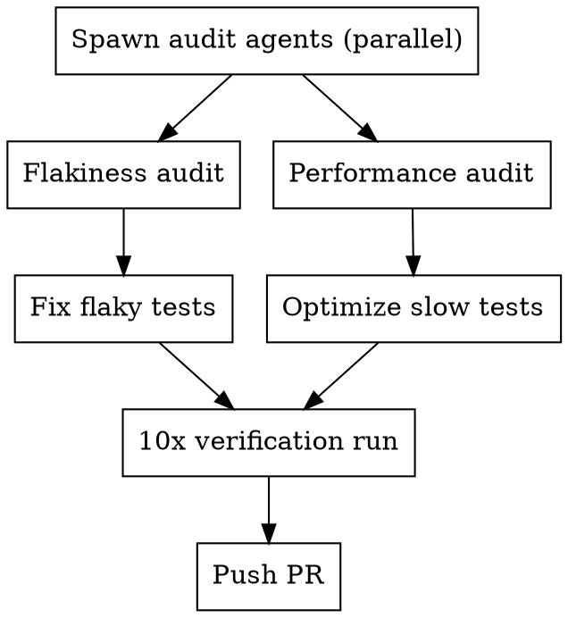

# Test Health Audit

Systematic review of a test suite for flakiness, performance, and coverage. Spawns a team to audit, fix, optimize, and verify.

## When to Use

- Tests pass/fail inconsistently (flaky)
- Test suite is slow or getting slower
- Coverage is unknown or declining
- Before a release or after a large feature lands
- CI is unreliable due to test issues

## The Process



### Phase 1: Parallel Audits

Spawn two research agents simultaneously:

**Flakiness Audit** (test-automator or QA agent):
- Identify all flaky tests and categorize root causes
- Search for these patterns across ALL test files:

| Pattern | Risk | Example |
|---------|------|---------|
| Shared filesystem paths | HIGH | Tests reading/writing same directory |
| Non-seeded RNG | HIGH | `thread_rng()`, `rand::rng()` in test paths |
| Timing dependencies | MEDIUM | `sleep()`, `Instant::now()`, elapsed checks |
| Global/static mutable state | HIGH | `lazy_static`, shared `Mutex`, `AtomicBool` |
| Execution order dependencies | MEDIUM | Tests that assume prior test ran |
| Probabilistic assertions | LOW | Monte Carlo with tight margins |

- Produce ranked report: test name, file:line, root cause, severity, fix approach

**Performance Audit** (performance-engineer agent):
- Profile test suite timing per file and per test
- Identify slowest tests and why they're slow:

| Pattern | Fix |
|---------|-----|
| Excessive loop counts (50k+) | Reduce to minimum proving the point |
| Brute-force probabilistic triggering | Pre-computed seeds or boosted parameters |
| Redundant negative assertions (P=0) | 100 iterations sufficient for structural impossibility |
| Expensive AI computation in tests | Reduce search depth or board size |
| Duplicate coverage across files | Consolidate or remove redundant tests |

- Produce ranked report: test name, time contribution, optimization, expected savings

### Phase 2: Parallel Fixes

Spawn fix agents based on audit findings. Common fix patterns:

**Flakiness fixes:**
- Shared filesystem -> isolated temp directories per test
- Non-seeded RNG -> seeded RNG or boosted parameters to make outcome deterministic
- Timing deps -> generous tolerances or remove timing dependency
- Global state -> per-test initialization

**Performance fixes:**
- Structural impossibility tests (P=0 by code path): reduce to 100-1k iterations
- Rare event triggering: boost parameters to increase probability + seeded RNG
- Statistical distribution tests: reduce samples, adjust thresholds proportionally
- Combat/simulation loops: give test characters overwhelming stats

### Phase 3: Coverage Check

After fixes, verify coverage hasn't regressed:
```bash
# Rust
cargo llvm-cov --summary-only

# JS/TS
npx jest --coverage --coverageReporters=text-summary

# Python
pytest --cov --cov-report=term-summary
```

Flag any modules below project threshold.

### Phase 4: Verification

Run the full test suite 10 times consecutively:
```bash
# Rust
for i in $(seq 1 10); do echo "Run $i"; cargo test 2>&1 | grep "test result:"; done

# JS/TS
for i in $(seq 1 10); do echo "Run $i"; npx jest 2>&1 | grep "Tests:"; done
```

**Pass criteria:** 0 failures across all 10 runs.

## Team Composition

| Role | Count | Task |
|------|-------|------|
| QA / test-automator | 1 | Flakiness audit |
| performance-engineer | 1 | Performance audit |
| QA / general-purpose | 1-3 | Fix flaky tests (parallelize by category) |
| Dev / general-purpose | 1 | Optimize slow tests |

Scale QA agents based on number of flaky test categories found.

## Common Mistakes

| Mistake | Fix |
|---------|-----|
| Reducing iteration count too aggressively | Keep enough for statistical confidence (3x expected hits minimum) |
| Fixing flakiness by adding sleep/retry | Fix root cause (isolation, determinism), not symptoms |
| Modifying production code to fix tests | Only change test code unless the production code has a genuine bug |
| Ignoring Monte Carlo tests as "probably fine" | Check margins are generous (2-5x expected range) |
| Skipping the 10x verification | Flakiness is probabilistic; 1 run proves nothing |
